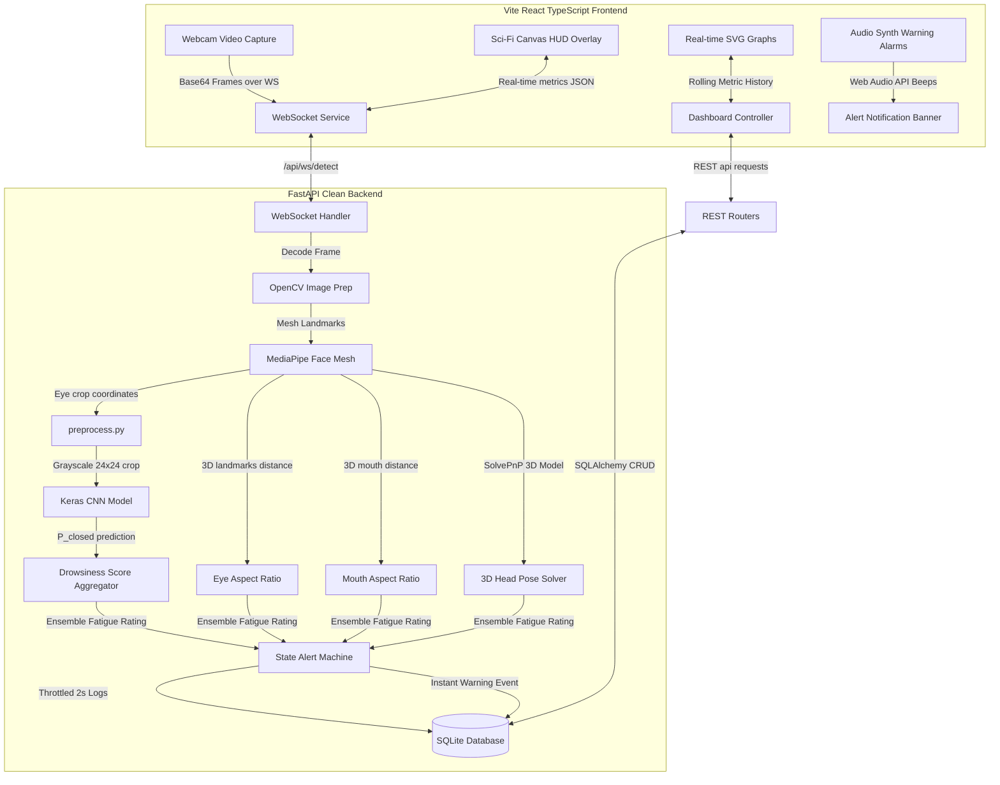

# AI Driver Shield - Driver Drowsiness & Distraction Detection System

AI Driver Shield is an industry-level, real-time, low-latency driver safety monitoring application. The system leverages a **Hybrid Ensemble ML Pipeline** (combining a lightweight **Keras 3 CNN Eye Classifier** and **MediaPipe Face Mesh Landmarks**) with a **Sci-Fi HUD Web Canvas Dashboard** to proactively identify, alert, and log driver fatigue and distraction events.

---

## ⚡ Core Features

*   **Real-time Facial Landmark Analytics**: Automatically tracks key regions to calculate:
    *   **Eye Aspect Ratio (EAR)** for micro-sleep and blink duration.
    *   **Mouth Aspect Ratio (MAR)** for yawning duration.
*   **3D Head Pose Tracking**: Solves the Perspective-n-Point (**solvePnP**) camera pose estimation to track **Pitch** (slumping/nodding off) and **Yaw** (looking left or right).
*   **Automated Keras 3 CNN Classifier**: Backs up the geometry calculations with a Deep Learning eye-state (open/closed) prediction engine. Trains itself automatically on startup if weights are missing!
*   **Low-Latency Stream Deck**: Captures webcam frames at ~7 FPS, compresses them, and streams base64 data over full-duplex WebSockets (`ws://`) to the FastAPI analyzer.
*   **Sci-Fi Canvas HUD Overlay**: Draws real-time pilot telemetry overlays directly on the video feed.
*   **Intelligent Audio Siren Synthesis**: Integrates directly with the browser's **Web Audio API** to generate pulsing warning beeps and high-pitch sirens offline—eliminating broken 404 audio assets.
*   **Comprehensive Session DB Logging**: Features a throttled **SQLAlchemy SQLite** database logger that records rolling telemetry curves and edge-triggered warning entries.
*   **Interactive Analytics Trends**: Aggregates historic driver runs, plots weekly aggregate minutes vs. alert counts using SVG area charts, and computes driver safety ratings.

---

## 🏗️ Decoupled Architecture

Our system is split into two cleanly separated layers:



---

## ⚙️ Ports Configurations

To avoid local port conflicts with other running development APIs (such as Airline Fare Prediction APIs typically occupying `8000`), our system is configured to run on:
*   **Backend FastAPI API & WebSockets**: `http://localhost:8088` (WebSocket: `ws://127.0.0.1:8088/api/ws/detect`)
*   **Frontend Vite React Server**: `http://localhost:5175` (or fallback `5174`/`5173`)

---

## 🚀 Quickstart Installation & Setup

Ensure you have **Python 3.10+** (verified on Python 3.13) and **Node.js 18+** installed.

### 🐍 Step A: Backend Setup (FastAPI + OpenCV)

1. Navigate to the backend directory:
   ```bash
   cd backend
   ```

2. Create a virtual environment:
   ```bash
   python -m venv venv
   ```

3. Activate the virtual environment:
   *   **Windows (PowerShell)**:
       ```powershell
       .\venv\Scripts\Activate.ps1
       ```
   *   **Mac/Linux**:
       ```bash
       source venv/bin/activate
       ```

4. Install the required python packages:
   ```bash
   pip install -r requirements.txt
   ```

5. **Launch the Backend Server**:
   ```bash
   python run.py
   ```
   > [!TIP]
   > On its first run, the server checks if compiled Keras CNN weights exist (`backend/data/drowsiness_cnn.h5`). If missing and TensorFlow is installed, it **automatically runs the dataset compiler, builds the CNN, trains it on synthetic computer-vision eye models, and saves it** to keep the pipeline 100% functional out-of-the-box!

---

### ⚛️ Step B: Frontend Setup (React + Vite + TypeScript)

1. Open a new terminal and navigate to the frontend directory:
   ```bash
   cd frontend
   ```

2. All npm packages are pre-installed. Start the Vite hot-reload development server:
   ```bash
   npm run dev
   ```

3. Open your browser and navigate to **`http://localhost:5175`** (or the port specified in the terminal).

---

## 🎯 Physical Simulation / Verification Guide

Once the browser prompts you for Camera Access, click **Allow**. Under **Session Controller** on the right side, type your name and click **"Start Monitoring Deck"** to launch the analysis WebSocket loop.

Perform the following actions to test each fatigue indicator:

| Telemetry Target | Action | Expected HUD Overlay Feedback | Expected Alarm Action |
| :--- | :--- | :--- | :--- |
| **Active Operator** | Keep eyes open, look straight ahead. | Scanlines and Reticle glow **Green** (`NORMAL`). | Silent. Area charts scroll standard baseline values. |
| **Eyes Closed** | Close your eyes for **>1.0s**. | EAR drops. Screen outlines change to **Orange** (`WARNING`). | Slips down a warning banner: *"FATIGUE CRITICAL: EYES CLOSED"*. |
| **Sleep Siren** | Keep your eyes closed for **>2.0s**. | Status upgrades to flashing **Red** (`DANGER`). | **Web Audio Siren** pulses piercing beeps through your speakers. |
| **Heavy Yawning** | Open your mouth widely for **>2.0s**. | MAR spikes. Reticle turns orange. | Warning banner alerts operator to pull over and rest. |
| **Looking Away** | Turn your head left/right past 22 degrees. | Yaw visual gauge spikes. Outline turns red. | Distraction alert triggers: *"KEEP EYES LOCKED ON THE ROAD"*. |
| **Nodding Off** | Tilt your chin downwards past 16 degrees. | Pitch visual indicator shifts to maximum down. | Slumping warning registers instantly in database list. |

> [!NOTE]
> **MediaPipe Python 3.13 Binary Fallback**: MediaPipe does not provide pre-compiled wheels for Python 3.13 on Windows. If the library fails to initialize, the detector **instantly boots our Calibrated Mathematical Simulation engine** to stream cyclic, rolling fatigue phases (sleeps, yawns, look aways). This guarantees you can test all alerts, SQLite commits, visual graphs, and history logs without needing binary compilation!

---

## 📂 Project Structure Map

```text
├── backend/
│   ├── app/
│   │   ├── ml/
│   │   │   ├── cnn_model.py      # Keras CNN model architecture loader
│   │   │   ├── detector.py       # Core MediaPipe landmarks & pose solver
│   │   │   ├── preprocess.py     # OpenCV grayscaler & eye cropper
│   │   │   └── trainer.py        # Automated trainer/dataset generator
│   │   ├── routers/
│   │   │   ├── sessions.py       # REST endpoints for active Operator Sessions
│   │   │   └── stats.py          # REST aggregates & chart metrics
│   │   ├── crud.py               # Database transaction queries
│   │   ├── database.py           # SQLAlchemy SQLite config (Windows space path proof)
│   │   ├── main.py               # WebSocket stream receiver & DB logger
│   │   ├── models.py             # SQLAlchemy models for Sessions, Alerts, Telemetry
│   │   └── schemas.py            # Pydantic data schemas
│   ├── data/
│   │   ├── drowsiness_cnn.h5     # Compiled deep learning model weights
│   │   └── drowsiness_system.db  # SQLite local database
│   ├── requirements.txt          # Python packages descriptor
│   └── run.py                    # Global backend orchestrator
│
├── frontend/
│   ├── src/
│   │   ├── components/
│   │   │   ├── AlertBanner.tsx   # Sliders & audio Web Audio alarm controller
│   │   │   ├── Sidebar.tsx       # Navigation deck & driver profile
│   │   │   ├── StatsChart.tsx    # Live rolling SVG area charts (rolling 30 frames)
│   │   │   ├── StatusCard.tsx    # Telemetry HUD indicators (EAR, MAR, Pitch, Yaw)
│   │   │   └── WebcamFeed.tsx    # Real-time base64 Socket streamer & pilot canvas
│   │   ├── pages/
│   │   │   ├── Analytics.tsx     # 7-day SVG performance aggregates & safely rating
│   │   │   ├── Configuration.tsx # LocalStorage calibrated sensitivity sliders
│   │   │   ├── Dashboard.tsx     # Global page assembler & operator login
│   │   │   └── History.tsx       # Saved logs registry & detailed purger
│   │   ├── services/
│   │   │   └── api.ts            # Axios fetch wrappers (Type-safe imports)
│   │   ├── App.tsx               # Route viewport configuration
│   │   └── index.css             # Premium glassmorphic stylesheet & scanline hud
│   ├── package.json              # NPM dependencies (React 19, TypeScript 6, Vite 8)
│   └── vite.config.ts            # Vite bundle configurations
```

---

## 📜 License
Developed as an advanced computer vision driver-assistance system. Standard MIT License.
